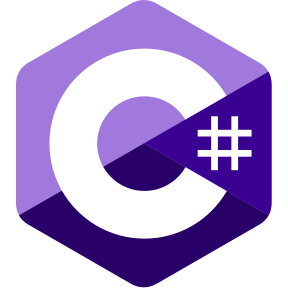

<h1 align="center">Olá 👋, Eu sou a Wendi Ramos</h1>
<h3 align="center">Desenvolvedora .NET | C#</h3>
 

- 🎓 Graduada em Análise e Desenvolvimento de Sistemas  
- 💻 Desenvolvimento de aplicações com C# e .NET  
- 🚀 Aprofundando conhecimentos em APIs e Arquitetura de Software  
- ☁️ Estudando Cloud (Azure e AWS)  
- 👨‍💻 LinkedIn <a href="https://www.linkedin.com/in/wendiramos/" target="_blank">Wendi S. Ramos</a>  
- 📫 E-mail para contato <a href="mailto:wendiramos12@gmail.com">wendiramos12@gmail.com</a>

<h3 align="center">Habilidades</h3>
 

